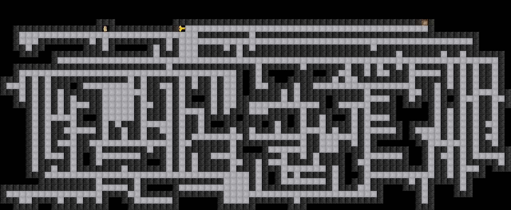
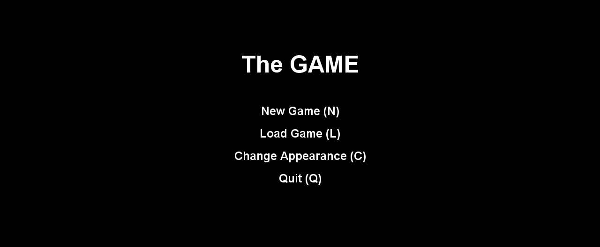
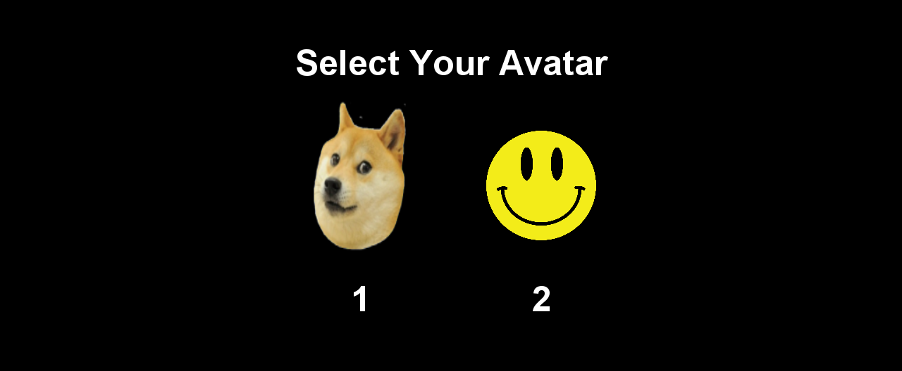
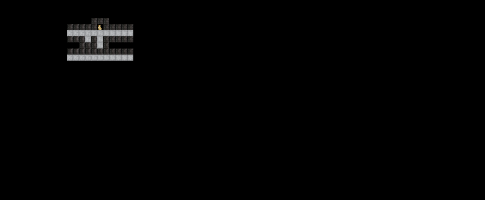
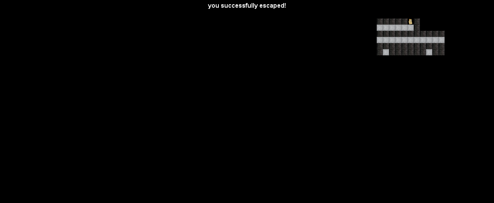
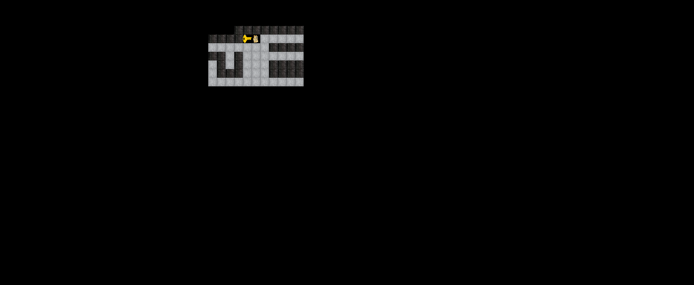
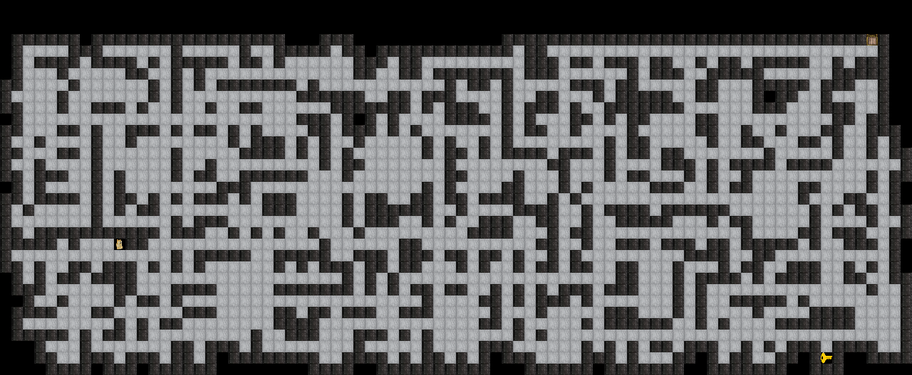
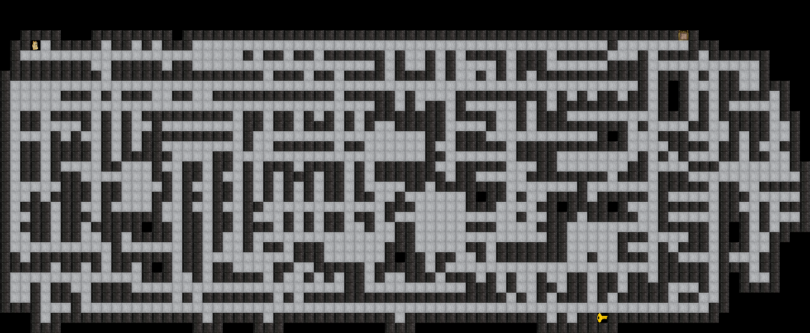

# theGame

A 2D random world generator and role play open world game.
### Preview
> night mode turned off

### Motivation
This project is one of the course projects from Data Structures and Algorithms course at UC Berkeley. This is a game design project that I did with my teammate Kunkai Lin. The project is to create a 2D Tile-based game that looks like Minecraft. Our job is to implement Engine.java, Space.java, Main.java, and Tileset.java. The challenge that I faced is to take care of the bounds of the world when trying to generate it randomly. There are several features implemented to make the game fun to play, such as setting the world to be night time. You can also change appearance of the avatar. You can also save the game and load back in later.

### Description
- Developed a Tile-based 2D game using Data Structures in Java that generates a random world.
- Integrated WeightedQuickUnionUF to connect in-game spaces.
- Designed the main menu and added extra features for better in-game experiences.
- Gained Software Engineering experience by applying engineering principles to solve problems to complete software projects.

### Skills to learn
- Java
- Software Development
- Object-Oriented Design
- Data Structures

> night mode turned on

> different seed generates different world

